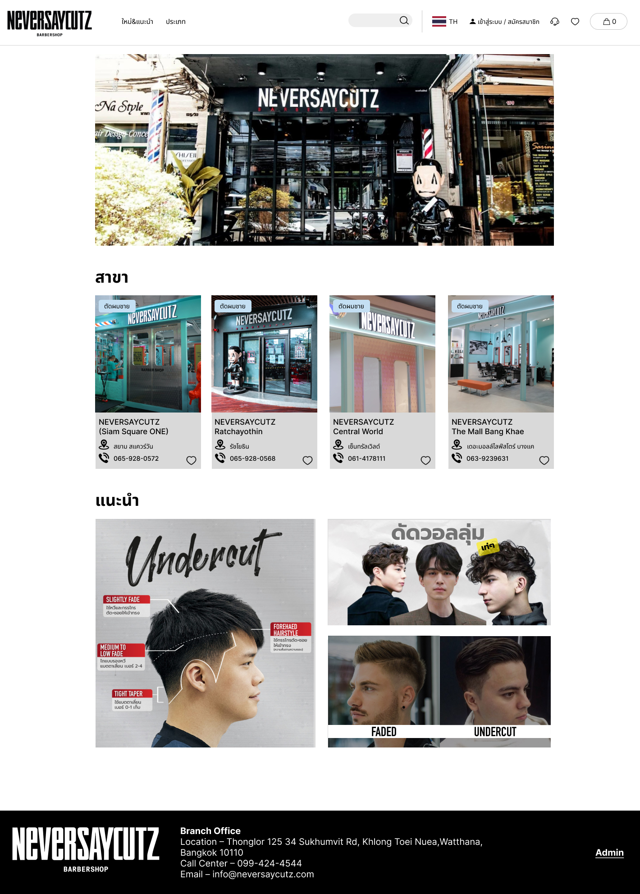
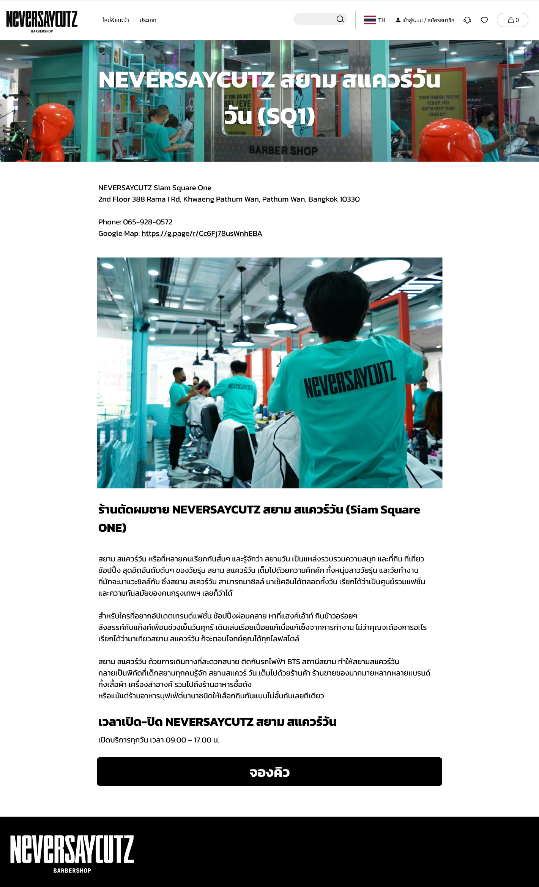
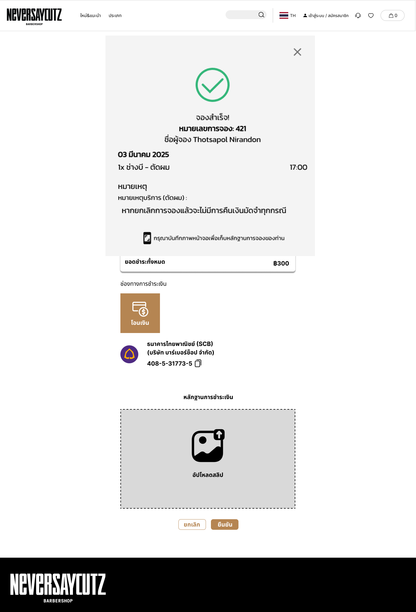
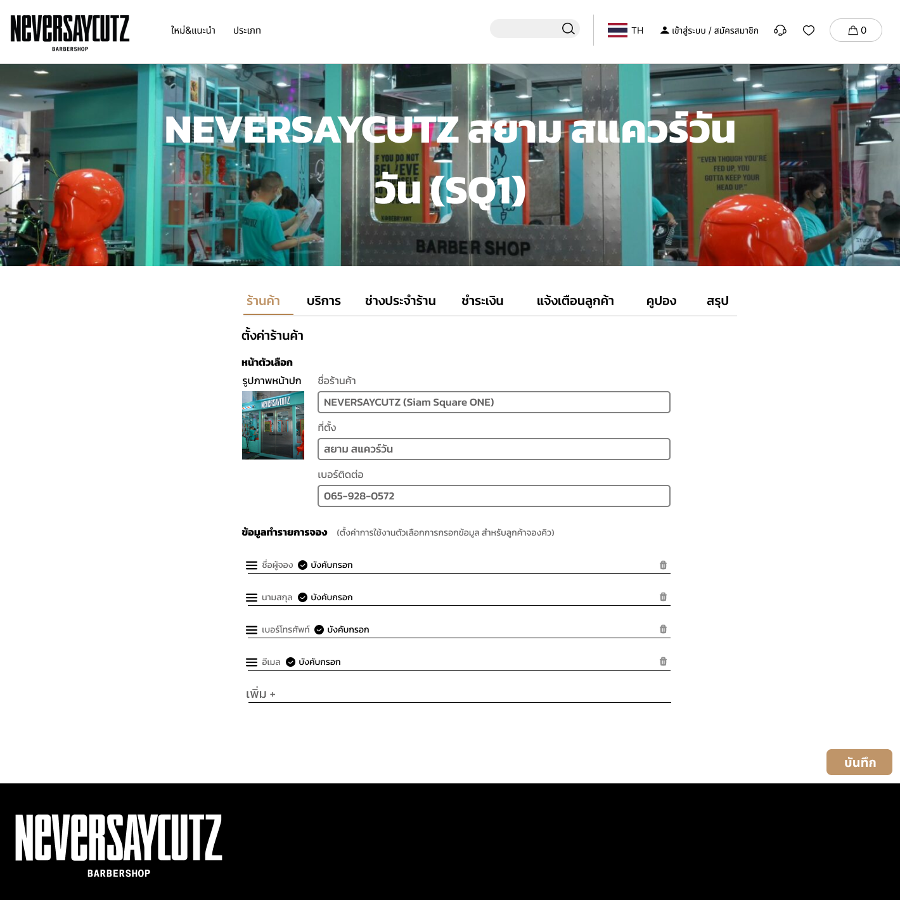

# โปรเจ็คระหว่างเรียน ปี 3 (2024)
# 💇‍♂️ NEVERSAYCUTZ - Salon Booking System

> **Frontend เว็บแอปพลิเคชันจองคิวร้านตัดผมที่ออกแบบด้วยหลัก UX/UI**



[](https://github.com/Thoserrr/Salon-Booking)
[](https://www.figma.com/design/JrP4K7w5Fw2zSJX5wvLcik/SalonBooking?node-id=0-1&t=n7MVzotuRIZJRwb6-1)
[](https://github.com/Thoserrr/Salon-Booking)

## 📖 เกี่ยวกับโปรเจ็ค

NEVERSAYCUTZ เป็นระบบจองคิวร้านตัดผมออนไลน์ที่ออกแบบและพัฒนาขึ้นเพื่อแสดงทักษะด้าน **UX/UI Design** และ **Frontend Development** โดยเน้นการสร้างประสบการณ์ผู้ใช้ที่ดีและการออกแบบที่ตอบสนองต่อความต้องการของลูกค้าและเจ้าของร้าน

## 🎨 Design Process & UX/UI Highlights

> 🎨 **[ดู Figma Design ต้นฉบับได้ที่นี่](https://www.figma.com/design/JrP4K7w5Fw2zSJX5wvLcik/SalonBooking?node-id=0-1&t=n7MVzotuRIZJRwb6-1)**

### 🎯 User Research & Problem Statement
- **Target Users**: ลูกค้าที่ต้องการจองคิวตัดผม และเจ้าของร้านที่ต้องการจัดการสาขา
- **Pain Points**: การรอคิวนาน, ไม่ทราบเวลาว่าง, การจัดการหลายสาขาที่ซับซ้อน
- **Solution**: ระบบจองคิวออนไลน์ที่ใช้งานง่าย พร้อมระบบจัดการสำหรับแอดมิน

### 🎨 Design System & Visual Identity
- **Color Palette**: โทนสีที่อบอุ่นและเป็นมิตร เหมาะกับธุรกิบบริการ
- **Typography**: ใช้ฟอนต์ที่อ่านง่าย รองรับภาษาไทย

### 🔄 User Journey & Flow
```
หน้าแรก → เลือกสาขา → เลือกบริการ → เลือกช่าง → เลือกวันเวลา → ยืนยันการจอง → เสร็จสิ้น
```

## ✨ Features & User Experience

### 🏠 **Homepage - First Impression**
- **Hero Section**: ภาพหลักที่ดึงดูดสายตา
- **Branch Selection**: แสดงสาขาทั้งหมดด้วย Visual Card
- **Search Functionality**: ค้นหาบริการได้ทันที
- **Responsive Navigation**: เมนูที่ใช้งานง่ายทุกอุปกรณ์

### 🎯 **Service Selection - Clear Choice**
- **Visual Service Cards**: แสดงบริการด้วยรูปภาพและราคาชัดเจน
- **Quick Booking**: ปุ่มจองที่เด่นชัด
- **Category Filter**: จัดกลุ่มบริการให้ง่ายต่อการเลือก

### 📅 **Booking Flow - Seamless Experience**
1. **Service Selection**: เลือกบริการที่ต้องการ
2. **Stylist Selection**: เลือกช่างตัดผม พร้อมข้อมูลประวัติ
3. **Date & Time**: ปฏิทินที่ใช้งานง่าย แสดงช่วงเวลาว่าง
4. **Customer Info**: กรอกข้อมูลลูกค้า
5. **Payment**: เลือกช่องทางการชำระเงิน
6. **Confirmation**: หน้ายืนยันการจองที่ครบถ้วน

### 🔐 **Authentication - Secure & Simple**
- **Login/Register**: UI ที่เรียบง่าย ไม่ซับซ้อน
- **Validation**: Form Validation ที่เป็นมิตรต่อผู้ใช้

### 👨‍💼 **Admin Panel - Management Made Easy**
- **Branch Management**: จัดการข้อมูลสาขาแต่ละแห่ง
- **Setup Wizard**: ขั้นตอนการตั้งค่าที่ง่ายและชัดเจน
- **Dashboard**: แสดงข้อมูลสำคัญได้อย่างเข้าใจง่าย

## 🛠️ Technical Implementation

### 📋 Tech Stack
- **Frontend**: HTML5, CSS3, JavaScript (Vanilla)
- **Design Tool**: Figma
- **Styling**: Custom CSS with Modern Flexbox/Grid
- **Icons & Assets**: Custom designed assets
- **Responsive**: Mobile-first approach

### 🎨 Design Resources
- **Figma Design**: [SalonBooking Design System](https://www.figma.com/design/JrP4K7w5Fw2zSJX5wvLcik/SalonBooking?node-id=0-1&t=n7MVzotuRIZJRwb6-1)
- **Design System**: Components, Colors, Typography
- **User Flow**: Complete booking journey
- **Wireframes**: Low-fi และ High-fi designs

# ภาพตัวอย่างการใช้งาน





